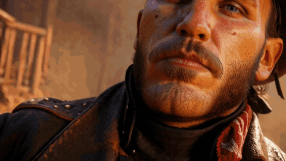
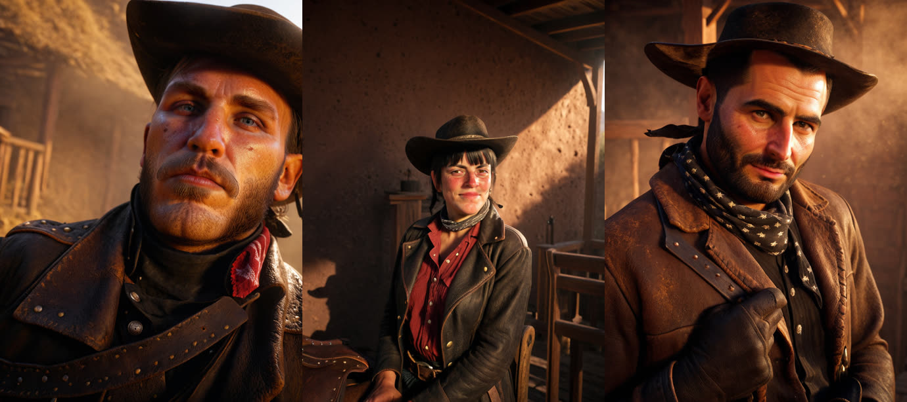
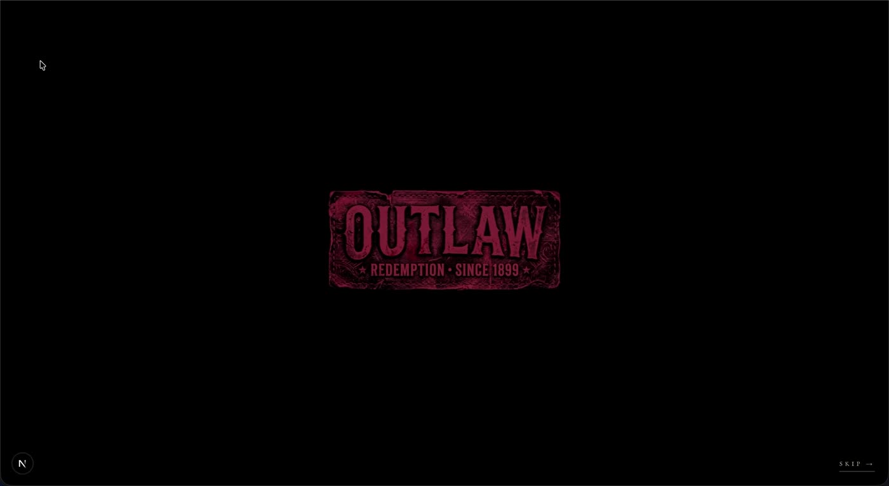
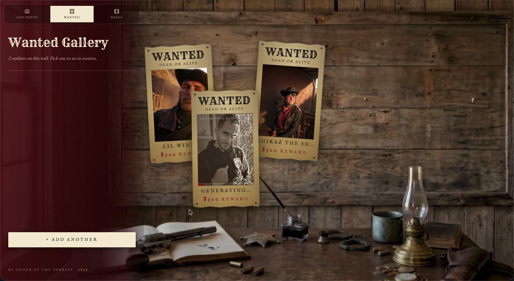
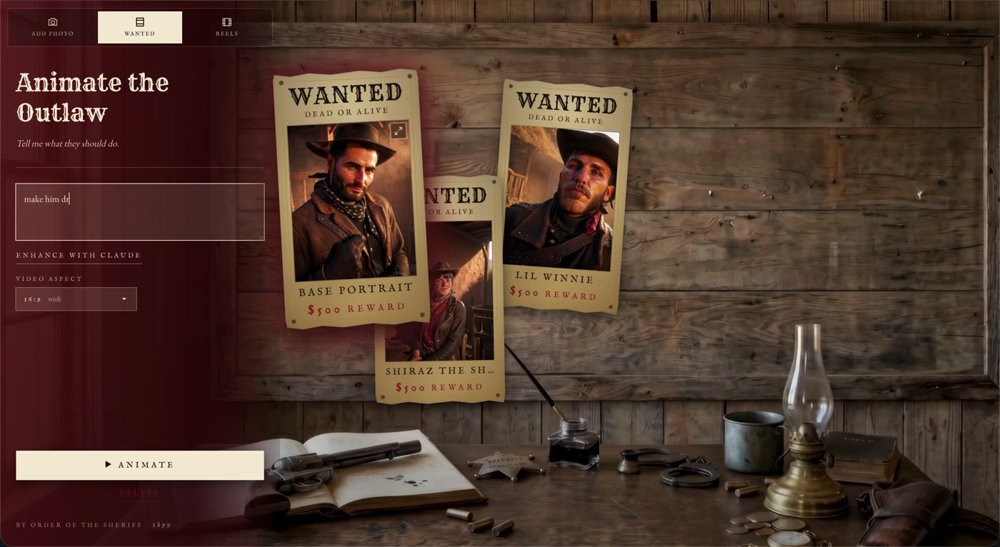
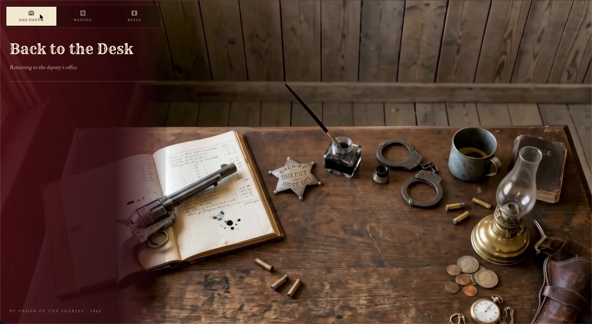
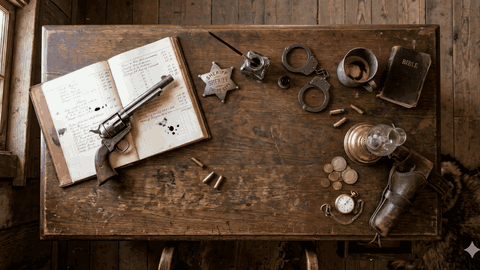

# Outlaw

> Drop a photograph on the sheriff's desk, and it comes back as a Red Dead Redemption 2 wanted poster — then set the poster in motion.

A local-first creative-AI app: a Next.js front end over a local **ComfyUI** image pipeline (SDXL + IPAdapter FaceID + ControlNet + FaceDetailer), **LTX-2** image-to-video, and **Claude Haiku** writing the motion prompts. Built as a home assignment for the Lightricks Creative-AI student program.

**This repository is a showcase, not the source.** The assignment's terms keep the code private, so what's here is the walkthrough and the results. Happy to screen-share the codebase and talk through any part of it.

<p align="center">
  
</p>

### ▶ [Watch the full walkthrough](demo/outlaw-walkthrough.mp4) — 1:45, upload to finished clip

<p align="center">
  
  <br><em>Three selfies, three outlaws — identity anchored by IPAdapter FaceID, styling by the scene prompt.</em>
</p>

---

## The flow

```
 selfie  ──▶  ComfyUI (SDXL + FaceID)  ──▶  3 wanted posters  ──▶  LTX-2 image-to-video  ──▶  5s clip
                     ~90s each,                streamed in                  prompt written by
                     run sequentially          over SSE                     Claude Haiku
```

1. **Identify the outlaw** — drop a photo on the deputy's desk and pick an aspect ratio.
2. **Generate** — one job produces three portraits: a base portrait plus two of six scenes (saloon poker, campfire, dawn duel, riding the plains, whiskey at the bar, ridge standoff). Each lands on the wanted wall the moment it finishes, rather than after the full ~5-minute run.
3. **Animate** — pick a poster, describe what the outlaw should do ("make him light a cigar"), and Claude Haiku folds that into the scene's camera and ambience as a single coherent LTX-2 prompt.
4. **Reels** — every clip and poster is cached on disk and pinned to the wall, so a refresh doesn't lose the run.

| | |
|---|---|
|  |  |
| **The desk** — upload | **The wall** — posters arrive one at a time |
|  |  |
| **Animate** — free-form motion, enhanced by Claude | **A moving picture** — the finished 5s clip |

The two rooms are joined by a real camera pan, played forward on the way in and reversed on the way back:

<p align="center"></p>

---

## How it's built

**Image generation** runs against ComfyUI Desktop on localhost. The workflow is fixed — Juggernaut XL, a cinematic-shot LoRA, an RDR2-style LoRA, IPAdapter FaceID Plus v2, ControlNet Depth and FaceDetailer — and exactly four nodes change per request: the positive prompt, the uploaded selfie, and fresh seeds for the sampler and the face pass.

**Video** goes through LTX-2's fast image-to-video model at 1080p for five seconds, after a two-step upload.

**Prompt writing** is a separate Claude Haiku call rather than string concatenation. The user's named action and props are non-negotiable in the output; only camera movement and ambience come from the scene.

### Decisions worth calling out

- **Portraits are generated sequentially, on purpose.** IPAdapter + ControlNet + FaceDetailer in parallel runs the M1 out of VRAM. The run takes ~5 minutes, so the cost is paid in the UI instead: posters stream in one at a time over SSE, behind a sketching animation.
- **A job outlives navigation.** The polling loop is keyed off a ref rather than the rendered step, so you can wander to Reels and back while three portraits are cooking without killing the run.
- **Video prompts describe action, never appearance.** The input image already carries identity; re-describing the face measurably degraded motion quality in early tests.
- **The enhancer's system prompt is stable and cached.** Identical on every call, so Claude's prompt cache serves the prefix at a fraction of the cost.
- **Cache first, upstream second.** Generated bytes are written to a local cache and served from there, so a refresh survives and expiring upstream URLs never reach the client.

## Limits

A localhost demo, deliberately. The job store is process-local, the cache is local disk, and generation speed is whatever the machine's GPU gives you — roughly 90 seconds per portrait on an M1.
